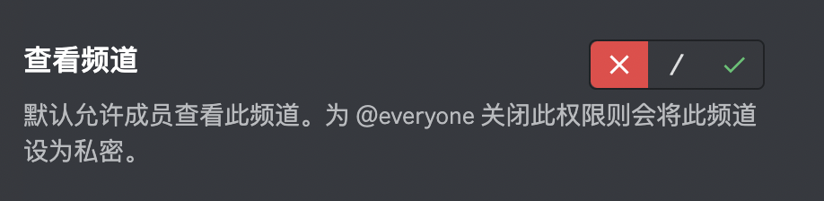

# 概念

## 服务器
Discord 提供您创建属于您自己的秘密基地的选择，您可以藉由寄出邀请挑选想一起消磨时间的朋友或社群。在这里，你可以聊天，打屁，与好友们度过欢乐时光。我们把这个特别的地方称为服务器，这个地方一般会长这个样子：

## 频道 
服务器将会有由文字频道与语音频道(待定)所构成
- 文字频道
文字频道顾名思义就是一个单独用文字交流的空间。他们让会话能更有条理，并且让所有成员都能有发言的空间。您可以为不同的主题分别建立不同的频道，让成员们知道要去哪里聊他们想谈的主题-- 举例来说，您可以为喜欢钓鱼，或喜欢煮饭炒菜的朋友分别设置不同的频道。

- 语音频道
语音频道是一个您能藉由语音或视讯跟朋友消磨时间的好所在。在这里，没有铃声，谁打给谁的这些概念- 您只需要按下任何一个语音频道，进去后就可以开始跟大家聊天。在伺服器中的朋友都会知道你现在在哪个频道，他们可以一起参与聊天，在萤幕的另一方向你挥手say hi，或是分享他们的画面。

## 权限
- 伺服器权限
> 个体在伺服器范围内的权限是其所在的所有身份组的权限之和。同时包括`@everyone`身份组的权限。
- 频道权限
> 频道权限是基于伺服器权限，其优先级制度如下：
  - 判定对@所有人身份组的解除权限
  - 判定对@所有人身份组的允许权限
  - 集合所有对该成员所在身份组的解除权限
  - 集合所有对该成员所在身份组的允许权限
  - 如果有特殊成员，判定对其的解除权限
  - 如果有特殊成员，判定对其的允许权限
- 身份组
> 使用身份组(Roles)管理权限
  - 身份组需要在服务器设置中添加
  - 在服务器设置身份组的`默认权限`，在频道中设置身份组的`特定权限`
    - 默认权限使用`switch`，特定权限使用三段切换开关  
    

# 使用
## 创建服务器
## 创建频道
## 使用频道
- 切换频道：
> 从左边频道列表中选择一个频道，之后该频道的内容将被显示在右侧的主画面中。

- 编辑频道
> 如果您在该频道中拥有编辑频道的权限，可以按一下该文字频道名旁边出现的齿轮图示，就能编辑该频道的设定。另外，您应该还会看到旁边出现一个带有加号（+）的人物图示，按一下该图示就可以寄出该频道的邀请连结给您的好友。

- 发消息
  - 文字
  - markdown支持
    - 斜体
    - 粗体
    - 下划线
    - 删除线
    - 代码块
    - 饮用
  - 链接的解析与渲染
  - Reaction
  - 回复
  - 提及
  - 上传文件
  - options
    - 表情
    - 隐藏消息
    - 快捷功能 /me /msg
